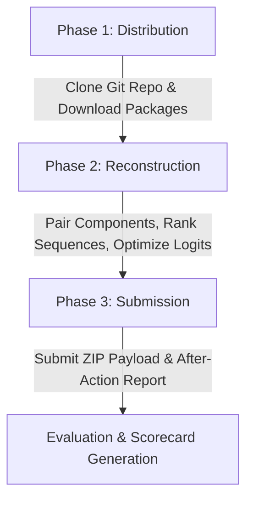

# 🌌 NSOC OPERATIONS COMMAND: OPERATION REBUILD FROM CHAOS
## 🧬 The Official Model Reconstruction Challenge Rule Book

> [!IMPORTANT]
> **MISSION DIRECTIVE:** Can you rebuild a trained neural intelligence grid from absolute, scrambled entropy?  
> **ORGANIZER:** NSOC (Neural Systems Operations Command)

---

## 🧭 TABLE OF CONTENTS
1. [Event Overview](#-1-event-overview)
2. [Forensic Mission & Objectives](#-2-forensic-mission--objectives)
3. [The Three Phases of Alignment](#-3-the-three-phases-of-alignment)
4. [Operative Repository Structure & Clone Guide](#-4-operative-repository-structure--clone-guide)
5. [Secured Telemetry (Dataset Analysis)](#-5-secured-telemetry-dataset-analysis)
6. [Dismantled Neural Core (Model Pieces)](#-6-dismantled-neural-core-model-pieces)
7. [Allowed File Formats](#-7-allowed-file-formats)
8. [Operative Team Directives](#-8-operative-team-directives)
9. [Tools and Resources Policy](#-9-tools-and-resources-policy)
10. [Submission Deliverables](#-10-submission-deliverables)
11. [Technical After-Action Report](#-11-technical-after-action-report)
12. [Score Grid & Evaluation Criteria](#-12-score-grid--evaluation-criteria)
13. [Verification & Organizers Discretion](#-13-verification--organizers-discretion)
14. [Stabilization Tie-Breakers](#-14-stabilization-tie-breakers)
15. [Disqualification Conditions](#-15-disqualification-conditions)
16. [NSOC Operations Philosophy](#-16-nsoc-operations-philosophy)

---

## 🌌 1. EVENT OVERVIEW

The **Model Reconstruction Challenge** is an elite, high-intensity machine learning and reverse-engineering competition. Operatives are dropped into a digital scenario where a trained deep residual neural network has been shattered into unlabelled weight matrices and bias tensors. 

```
   [ ORIGINAL TRAINED MODEL ]
               │
               ▼  (Catastrophic Entropy / Corruption Event)
   [ SHUFFLED WEIGHT FRAGMENTS ] ──► (piece_0.pth ... piece_N.pth)
               │
               ▼  (Your Mission: Apply Mathematical Forensics)
   [ PERFECTLY ALIGNED CLASSIFICATION GRID ]
```

This operations exercise has been designed by NSOC to evaluate:
*   **Deep Neural Network Topologies:** Structural mapping of parameters and connections.
*   **Reverse-Engineering Diagnostics:** Analytical heuristics of trained weight variables.
*   **Combinatorial Optimization:** Search algorithms, matching strategies, and graph reassembly.

---

## 🎯 2. FORENSIC MISSION & OBJECTIVES

A trained residual network model digit categorization head has been compromised. All $N$ constituent linear layers and block parameters have been separated into a chaotic collection (`piece_0.pth` to `piece_N.pth`). 

Your objective is to:
1.  **Analyze the Fragmented Matrix Layers:** Analyze weight shapes, biases, and parameters.
2.  **Match and Pair Components:** Correctly identify and pair input projections with their corresponding output projections.
3.  **Perform Sequential Reassembly:** Discover the precise sequential order of the paired blocks from first ($1$) to last ($K$).
4.  **Restore the Signal Grid:** Reassemble the model so that its predictions align with the original intact model's classification accuracy and output logits.

---

## ⏳ 3. THE THREE PHASES OF ALIGNMENT

The operational challenge is divided into three distinct chronological stages:



### 🛰️ Phase 1: Distribution
Operatives receive the challenge workspace containing shuffled model weights, historical alignment data, verification tools, and starter guidelines.

### ⚙️ Phase 2: Reconstruction
Operatives run exploratory analysis on the raw weights, implement pairing strategies, map the block sequences, and locally test and optimize their reassembled models.

### 📡 Phase 3: Submission
Teams package their reassembled model configurations, pipeline code, and a technical intelligence report, transmitting the final payload to the scoring system.

---

## 📦 4. OPERATIVE REPOSITORY STRUCTURE & CLONE GUIDE

To streamline deployment and code syncing, all assets are tracked under a local workspace repository. Use the following guidelines to configure your local environment:

```bash
# Clone the central NSOC challenge repository
git clone https://github.com/nsoc-club/model-reconstruction-chaos.git
cd model-reconstruction-chaos

# Spawn your dedicated local Team branch (Do not push to main!)
git checkout -b team-[your_team_name]

# Synchronize development environment
pip install -r requirements.txt
```

### 📂 Repository Topology
```text
model-reconstruction-chaos/
├── data/
│   ├── pieces/                    # Scrambled weight fragments (piece_0.pth to piece_N.pth)
│   ├── historical_data.csv        # Calibration alignment telemetry
├── samples/
│   ├── sample_submission.csv      # Standard configuration layout
│   └── random_submission.csv      # Example randomized baseline mapping
├── starter_kit.ipynb              # Guided interactive forensic starter notebook
├── requirements.txt               # Required package dependencies
├── README.md                      # Deployment instructions
└── RULES.md                       # This Operations Manual
```

---

## 📊 5. SECURED TELEMETRY (DATASET ANALYSIS)

The provided calibration dataset serves as intermediate alignment coordinates to verify your reconstruction pipeline.

### 📈 `data/historical_data.csv`
A secured telemetry database capturing representative raw inputs processed by the original intact network:
*   `pixel_0` through `pixel_X`: Normalized input feature coordinates.
*   `pred_logit_0` through `pred_logit_Y`: The classification logits produced by the final head of the pristine network.
*   `true_label`: The actual target classification label.

### 📋 `samples/sample_submission.csv`
A template demonstrating the format for submitting block alignments:
```csv
block_index,inp_piece,out_piece
0,piece_A.pth,piece_B.pth
1,piece_C.pth,piece_D.pth
...
K-1,piece_Y.pth,piece_Z.pth
```

---

## 🧬 6. DISMANTLED NEURAL CORE (MODEL COMPONENTS)

The scrambled files consist of dictionary states containing weight and bias tensors. They are categorized strictly by their shapes, corresponding to the layers of a deep residual architecture:

*   **Front Projection Layer (`proj`):** Maps input space dimensions $D_{\text{in}}$ down to a latent space dimension $D_{\text{latent}}$.
*   **Output Classification Layer (`last`):** Maps latent space dimensions $D_{\text{latent}}$ to output classes $D_{\text{classes}}$.
*   **Block Input Projections ($W_{\text{in}}$):** Maps latent features $D_{\text{latent}}$ up to a sub-block dimension $D_{\text{sub}}$.
*   **Block Output Projections ($W_{\text{out}}$):** Maps sub-block dimensions $D_{\text{sub}}$ back down to $D_{\text{latent}}$.

### 📐 Residual Block Architecture
Each reconstructed block $k \in [0, K-1]$ maps incoming features $x$ using the following residual logic:

$$\text{Block}_k(x) = x + W_{\text{out}}^{(k)} \operatorname{ReLU}\left(W_{\text{in}}^{(k)} x + b_{\text{in}}^{(k)}\right) + b_{\text{out}}^{(k)}$$

The objective is to discover the correct pairings $(W_{\text{in}}^{(k)}, W_{\text{out}}^{(k)})$ and sequence order $0 \dots K-1$ that reconstructs the network.

---

## 💾 7. ALLOWED FILE FORMATS

Ensure that your solution utilizes only the following extensions:
*   **Approved Formats:** `.py`, `.ipynb`, `.csv`, `.pth`, `.txt`, `.json`
*   **Prohibited Formats:** Compiled executable binaries or external model weights.

---

## 👥 8. OPERATIVE TEAM DIRECTIVES

*   **Team Size:** 1 to 3 members.
*   **Independent Analysis:** Teams must work in complete isolation. Inter-team communication or coordinate sharing is strictly forbidden.
*   **Submission Limit:** Exactly one final transmission package per team will be verified on the main scoring grid.

---

## 🛠️ 9. TOOLS AND RESOURCES POLICY

*   **Approved:** Open-source Python libraries (e.g., PyTorch, NumPy, SciPy, Scikit-Learn, Pandas), documentation, and academic literature.
*   **Prohibited:** Sharing code blocks with other teams, using external datasets, or leveraging internet-based black-box solving APIs.

---

## 📨 10. SUBMISSION DELIVERABLES

Your final submission package must be compressed into a single ZIP archive formatted as `[team_name].zip` containing:
```text
[team_name].zip/
├── solution.py                 # Automated reassembly script
├── final_model.pth             # Reconstructed model weights
├── submission.csv              # Reassembled indices spreadsheet
├── report.pdf                  # Technical report
└── requirements.txt            # Your environment dependency configurations
```

---

## 📝 11. TECHNICAL AFTER-ACTION REPORT

Your team must deliver a formal technical report (`report.pdf`). The report should cover:
1.  **Introduction:** Understanding of the model deconstruction and reconstruction objectives.
2.  **Methodology:** Your analytical strategy for pairing inputs/outputs and sequencing the blocks.
3.  **Implementation:** Algorithms, search strategies, and libraries utilized.
4.  **Experiments & Results:** Evaluation metrics, validation curves, and parameter configurations.
5.  **Challenges Faced:** Details of computational or numerical obstacles encountered and how they were resolved.
6.  **Conclusion:** Key findings and recommendations.

---

## 📈 12. SCORE GRID & EVALUATION CRITERIA

The final evaluation score is calculated using the following weight distribution:

$$\text{Final Score} = (0.70 \times \text{Model Performance}) + (0.30 \times \text{Report Score})$$

### ⚙️ Model Performance (70 Marks)
*   **Model Accuracy / Logits Alignment:** 50 Marks — Evaluates how closely the reconstructed model's logits match the target values.
*   **Reconstruction Structural Quality:** 10 Marks — Grading of pairing accuracy and sequence order.
*   **Runtime & Computational Efficiency:** 10 Marks — Performance overhead of your reassembly code.

### 📝 Report Evaluation (30 Marks)
*   **Technical Explanation:** 10 Marks — Depth and clarity of mathematical and structural analysis.
*   **Methodology & Innovation:** 8 Marks — Rigor and uniqueness of the pairing and search strategies.
*   **Experimental Analysis:** 6 Marks — Quality of testing, parameter logs, and performance curves.
*   **Presentation & Clarity:** 4 Marks — Document structure and readability.
*   **Reproducibility:** 2 Marks — Cleanliness of configuration guides and scripts.

---

## ⚖️ 13. VERIFICATION & ORGANIZERS DISCRETION

> [!IMPORTANT]
> **JUDGING PANEL RULE:** The final evaluation, grading decisions, score validation, and official rankings rest solely at the absolute discretion of the NSOC organizing team. The decisions of the judging panel are final and absolute.
>
> Submissions that utilize hardcoded indices, memorized mappings, or bypass the core reassembly logic will be flagged during verification, resulting in an automated score of `0.0`.

---

## ⚖️ 14. STABILIZATION TIE-BREAKERS

In the event of score synchronization on the leaderboard, the ranking system will execute the following automated tie-breaking hierarchy:
1.  **Lowest Prediction Logits MSE**
2.  **Highest Layer Pairing Accuracy**
3.  **Exact Sequential Match**
4.  **Least Forward Evaluations (Computational Efficiency)**
5.  **Earliest Submission Timestamp**

---

## 🚨 15. DISQUALIFICATION CONDITIONS

Your team will face immediate disqualification if any of the following parameters are violated:
*   **Plagiarism:** Copying code blocks or reports from other registered teams.
*   **Dataset Tampering:** Artificial manipulation of reference predictions or injection of external lookups.
*   **Collusion:** Sharing intermediate matching indices or parameters with competing teams.
*   **Multi-Identity Submissions:** Registering multiple times under different handles or proxy names.

---

## 🎯 16. NSOC OPERATIONS PHILOSOPHY

The competition rewards:
*   **Analytical Rigor:** Discovering mathematical indicators in parameters rather than using brute force.
*   **Algorithmic Efficiency:** Designing solutions that achieve optimal alignment with minimal computational resources.
*   **Creative Problem Solving:** Formulating robust search and ranking algorithms to resolve high-dimensional matching challenges.

---

```
[SYSTEM NOTICE]
RESTORE ALIGNMENT. REBUILD FROM CHAOS.
```
