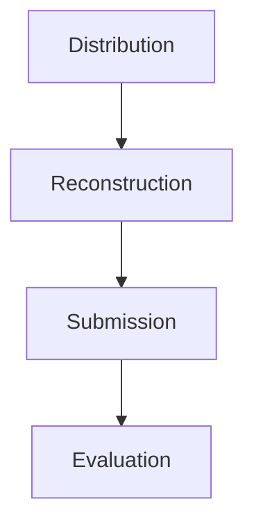

# NSOC OPERATIONS COMMAND: OPERATION REBUILD FROM CHAOS

## The Official Model Reconstruction Challenge Rule Book

> [!IMPORTANT]
> **MISSION DIRECTIVE:** Can you rebuild a trained neural intelligence grid from absolute, scrambled entropy?
>
> **ORGANIZER:** NSOC (Neural Systems Operations Command)

---

# TABLE OF CONTENTS

1. Event Overview
2. Forensic Mission & Objectives
3. The Three Phases of Alignment
4. Operative Repository Structure & Clone Guide
5. Secured Telemetry (Dataset Analysis)
6. Dismantled Neural Core (Model Pieces)
7. Allowed File Formats
8. Operative Team Directives
9. Tools and Resources Policy
10. Submission Deliverables
11. Technical After-Action Report
12. Score Grid & Evaluation Criteria
13. Verification & Organizers Discretion
14. Stabilization Tie-Breakers
15. Disqualification Conditions
16. NSOC Operations Philosophy

---

# 1. EVENT OVERVIEW

The Model Reconstruction Challenge is an elite machine learning reverse-engineering competition.

Participants are provided with fragments of a trained residual neural network whose original architecture has been intentionally destroyed. Your objective is to reconstruct the original network topology and recover its predictive behavior as accurately as possible.

```text
[ ORIGINAL TRAINED MODEL ]
           │
           ▼
     Corruption Event
           │
           ▼
[ SHUFFLED MODEL PIECES ]
           │
           ▼
 Reverse Engineering
           │
           ▼
[ RECONSTRUCTED NETWORK ]
```

This challenge evaluates:

* Neural network architecture understanding
* Weight-space analysis
* Reverse engineering methodology
* Combinatorial optimization
* Scientific experimentation

---

# 2. FORENSIC MISSION & OBJECTIVES

A trained residual network has been fragmented into multiple independent parameter files.

Your mission is to:

1. Analyze weight fragments.
2. Determine correct layer pairings.
3. Recover residual block ordering.
4. Reconstruct the original network.
5. Minimize output-logit reconstruction error.

---

# 3. THE THREE PHASES OF ALIGNMENT



## Phase 1 — Distribution

Participants receive:

* Fragmented model weights
* Historical telemetry data
* Starter notebook
* Validation assets

## Phase 2 — Reconstruction

Participants:

* Analyze tensor statistics
* Pair components
* Recover ordering
* Build reconstruction pipelines
* Optimize model performance

## Phase 3 — Submission

Teams submit:

* Reconstruction code
* Final model
* Submission file
* Technical report

---

# 4. OPERATIVE REPOSITORY STRUCTURE & CLONE GUIDE

```bash
git clone <official_repository_url>
cd OPERATION-REBUILD_FROM_CHAOS

pip install -r requirements.txt
```

## Repository Structure

```text
OPERATION-REBUILD_FROM_CHAOS/
├── data/
│   ├── pieces/
│   └── historical_data.csv
│
├── samples/
│   ├── sample_submission.csv
│   └── random_submission.csv
│
├── starter_kit.ipynb
├── requirements.txt
├── README.md
└── RULES.md
```

---

# 5. SECURED TELEMETRY (DATASET ANALYSIS)

## historical_data.csv

Contains:

* Input feature vectors
* Intermediate output logits
* Ground-truth labels

### Columns

```text
pixel_0 ... pixel_N
pred_logit_0 ... pred_logit_M
true_label
```

The telemetry dataset serves as the primary validation source for reconstruction quality.

---

# 6. DISMANTLED NEURAL CORE (MODEL COMPONENTS)

Each `.pth` file contains weight and bias tensors belonging to one component of the original architecture.

## Component Categories

### Front Projection Layer (`proj`)

Maps:

```text
D_in → D_latent
```

### Classification Head (`last`)

Maps:

```text
D_latent → D_classes
```

### Block Input Projection

```text
W_in
```

Maps:

```text
D_latent → D_sub
```

### Block Output Projection

```text
W_out
```

Maps:

```text
D_sub → D_latent
```

---

## Residual Block Architecture

Each residual block follows:

$$
\text{Block}_k(x)
=================

x
+
W_{\text{out}}^{(k)}
,
\text{ReLU}
\left(
W_{\text{in}}^{(k)}x+b_{\text{in}}^{(k)}
\right)
+
b_{\text{out}}^{(k)}
$$

Participants must determine:

* Correct input/output pairings
* Correct residual block sequence
* Correct global architecture reconstruction

---

# 7. ALLOWED FILE FORMATS

## Approved

* .py
* .ipynb
* .csv
* .pth
* .txt
* .json

## Prohibited

* Executable binaries
* External pretrained weights
* Compiled artifacts

---

# 8. OPERATIVE TEAM DIRECTIVES

* Team size: 1–3 members
* One submission per team
* Independent work only
* No inter-team collaboration

---

# 9. TOOLS AND RESOURCES POLICY

## Allowed

* PyTorch
* NumPy
* Pandas
* SciPy
* Scikit-Learn
* Matplotlib
* Academic literature
* Public documentation

## Not Allowed

* External datasets
* External model checkpoints
* Black-box solver APIs
* Sharing solutions between teams

---

# 10. SUBMISSION DELIVERABLES

Submit:

```text
team_name.zip
│
├── solution.py
├── final_model.pth
├── submission.csv
├── report.pdf
└── requirements.txt
```

---

# 11. TECHNICAL AFTER-ACTION REPORT

The report should include:

1. Introduction
2. Problem Understanding
3. Methodology
4. Reconstruction Strategy
5. Experimental Results
6. Ablation Studies
7. Challenges Faced
8. Conclusion

---

# 12. SCORE GRID & EVALUATION CRITERIA

The final score is evaluated on a 100-point scale.

## Model Performance (70 Marks)

| Evaluation Area        | Marks  |
| ---------------------- | ------ |
| Logits Alignment / MSE | 50     |
| Reconstruction Quality | 10     |
| Runtime & Efficiency   | 10     |
| **Subtotal**           | **70** |

### Logits Alignment

Measures closeness between reconstructed logits and reference logits.

### Reconstruction Quality

Measures:

* Layer pairing correctness
* Sequential ordering correctness

### Runtime & Efficiency

Measures:

* Execution speed
* Computational footprint
* Search efficiency

---

## Report Evaluation (30 Marks)

| Evaluation Area          | Marks  |
| ------------------------ | ------ |
| Technical Explanation    | 10     |
| Methodology & Innovation | 8      |
| Experimental Analysis    | 6      |
| Presentation & Clarity   | 4      |
| Reproducibility          | 2      |
| **Subtotal**             | **30** |

---

## Total Score

| Category          | Marks   |
| ----------------- | ------- |
| Model Performance | 70      |
| Report Evaluation | 30      |
| **TOTAL**         | **100** |

---

# 13. VERIFICATION & ORGANIZERS DISCRETION

> [!IMPORTANT]
>
> Final rankings, score validation, and evaluation decisions remain solely at the discretion of the NSOC organizing committee.
>
> Any attempt to bypass reconstruction methodology through hardcoded mappings, leaked solutions, or direct answer recovery techniques may result in disqualification.

---

# 14. STABILIZATION TIE-BREAKERS

Ties are resolved using:

1. Lowest Logits MSE
2. Highest Reconstruction Accuracy
3. Highest Sequential Accuracy
4. Lowest Runtime Cost
5. Earliest Submission Timestamp

---

# 15. DISQUALIFICATION CONDITIONS

Immediate disqualification may occur for:

* Plagiarism
* Solution sharing
* Dataset tampering
* Multiple registrations
* Unauthorized external resources
* Submission manipulation

---

# 16. NSOC OPERATIONS PHILOSOPHY

This challenge rewards:

## Analytical Rigor

Understanding model structure rather than brute-force search.

## Scientific Methodology

Careful experimentation and reproducible evaluation.

## Efficient Algorithms

Balancing accuracy with computational efficiency.

## Creative Problem Solving

Developing innovative reconstruction strategies under uncertainty.

---

```text
[SYSTEM NOTICE]

RESTORE ALIGNMENT.
REBUILD FROM CHAOS.
```
